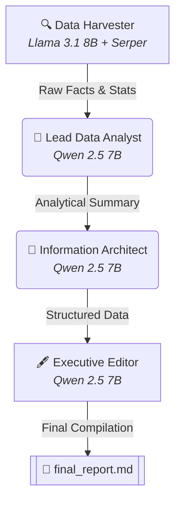

# 🤖 Aether Analytics Group (AAG) - CrewAI Pipeline

> **BIU DS26 - Exercise 05: AI Agent Orchestration and Move to Production**
>
> An executive-ready multi-agent data intelligence pipeline built with **CrewAI** and **LiteLLM / OpenRouter**, utilizing a hybrid dual-LLM structure (Llama 3.1 & Qwen 2.5) to optimize functionality, tool-use, and token costs.

---

## 📊 Pipeline Architecture

This project implements a **Sequential Process** (pipe) simulating a premium data intelligence firm (*Aether Analytics Group*). The data flows sequentially from the harvesting phase through analysis, structural design, and final editorial compilation.



---

## 👥 The Agents

The crew consists of **four specialized agents** sharing a unified corporate identity (`ORG_BACKSTORY`) to ensure polite, elite, and precise communication:

1. **Senior Data Harvester (Collector)**: 
   * **Goal**: Search the web and gather raw data, news, and statistics.
   * **LLM**: Llama 3.1 8B (specifically chosen for its robust, reliable tool/function calling support).
   * **Tools**: `SerperDevTool` (Google Search integration).
2. **Lead Data Analyst (Analyst)**: 
   * **Goal**: Read the raw harvest and extract the top 3 trends and their industry implications.
   * **LLM**: Qwen 2.5 7B (highly cost-effective text model).
3. **Information Architect (Visualizer)**: 
   * **Goal**: Format the findings into highly-readable markdown tables and clear lists.
   * **LLM**: Qwen 2.5 7B.
4. **Executive Editor & Publisher (Compiler)**: 
   * **Goal**: Compile, polish, and structure everything into the final executive dossier.
   * **LLM**: Qwen 2.5 7B.

---

## ⚙️ Configuration & Move to Production

To transition this proof-of-concept into a resilient, production-ready pipeline, we addressed key engineering bottlenecks:
* **Hybrid LLM Architecture**: Rather than running the expensive Qwen 72B or hitting tool-calling bugs on Qwen 7B, we split the tasks. Tool-using agents run on Llama 3.1 8B, while text-only processing runs on Qwen 2.5 7B.
* **Pre-flight Budget Limits**: Bounded requests using `max_tokens=1500` to prevent pre-flight cost verification failures on OpenRouter accounts with micro-balances.
* **Console Compatibility**: Reconfigured terminal output streams for UTF-8 to support rich visual logs (emojis) on Windows shells.
* **Security (Cyber Security)**: Configured a strict `.gitignore` to prevent committing API keys (`.env`) or local virtual environments to source control.

---

## 🚀 How to Run the Pipeline

### 1. Installation
Clone the repository and set up a virtual environment:
```powershell
# Create & activate environment
python -m venv venv
.\venv\Scripts\Activate.ps1

# Install requirements
pip install -r requirements.txt
```

### 2. Add API Keys
Create a `.env` file in the root folder based on `.env.example`:
```ini
OPENROUTER_API_KEY=your_openrouter_api_key_here
SERPER_API_KEY=your_serper_api_key_here
```

### 3. Run the Crew
Initiate the orchestration:
```powershell
python main.py
```

The output will trace the agents' logs in real-time (`verbose=True`) and compile the final report into **[final_report.md](final_report.md)**.
